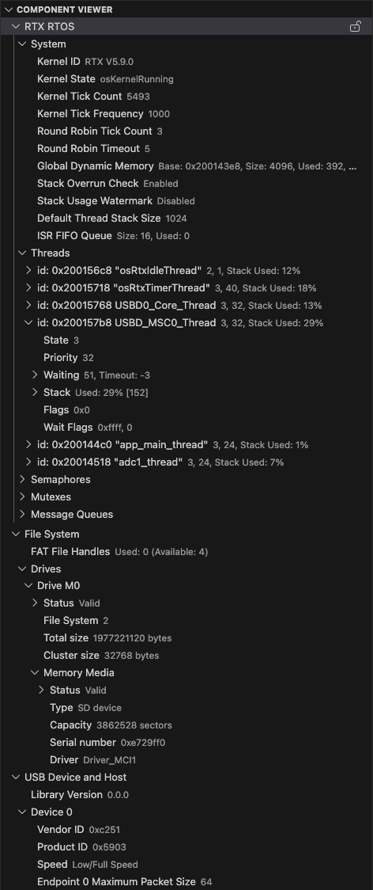

# Debug

## Debugger User Interface

Many features of the CMSIS Debugger extension are exposed in the **Run and Debug** view of VS Code.

1. **Start debugging** selects a configuration: _launch_ to start download/debug, _attach_ to connect with a running system.
2. **Debug Toolbar** has buttons for the most common debugging actions that control execution.
3. The **Trace and Live View** shows the **LIVE WATCH** window.
4. **Debug Statusbar** shows the time spent running the application.
5. The **Debug Console** can be used to interact with the debugger on the command line.


Most editor features are available during debugging. For example, developers can use Find and edit source code to correct program errors.

The **Run and Debug** view provides:

- [**VARIABLES**](#variables) section, which includes local function variables and CPU register values.
- [**WATCH**](#watch) section, which allows viewing user-defined expressions, for example, variable values.
- [**CALL STACK**](#call-stack) section that shows active RTOS threads along with the call stack.
- [**BREAKPOINTS**](#breakpoints) section for managing stop points in application execution to inspect the state.

> **TIP**<br>
> Click on a _line number badge_ to navigate to the source code line.

Other debugger specific views or features:

- [**Live Watch**](#trace-and-live-view) offers run-time viewing of user-defined expressions, for example, variable
  values.
- [**Disassembly**](#disassembly) shows assembly instructions and supports run control, for example with stepping and
  breakpoints.
- [**Debug Console**](#debug-console) lists debug output messages and allows entering expressions or GDB commands.
- [**Peripherals**](#peripherals) show the device peripheral registers and allow changing their values.
- [**Serial Monitor**](#serial-monitor) uses serial or TCP communication to interact with application I/O functions
  (`printf`, `getc`, etc.).
- [**CPU Time**](#cpu-time) shows execution timing and statistics of the past five breakpoints.
- [**Multi-Core Debug**](#multi-core-debug) to view and control several processors in a device.

### Debug toolbar

During debugging, the **Debug toolbar** contains actions to control the flow of the debug session, such as stepping through code, pausing execution, and stopping the debug session.


| Action | Description |
|--------|-------------|
| Continue/Pause | **Continue**: Resume normal program execution (up to the next breakpoint).<br>**Pause**: Inspect code executing at the current location. |
| Step Over | Execute the next statement as a single command without inspecting or following its component steps. |
| Step Into | Enter the next statement to follow its execution line-by-line. |
| Step Out | When inside a function, return to the earlier execution context by completing remaining lines of the current method as though it were a single command. |
| Restart | Terminate the current program execution and start debugging again using the current run configuration. |
| Stop/Disconnect | **Stop**: Terminate the current debug session.<br>**Disconnect:** Detach debugger from a core without changing the execution status (running/pause). |
| Debug Session | For multi-core devices, the list of active debug sessions and switch between them. |
| Reset Target | Reset the target device. |

### VARIABLES

During debugging, you can inspect variables, expressions, and registers in the **VARIABLES** section of the **Run and Debug view** or by hovering over a variable or expression in the source code editor. Variable values and expressions are evaluated in the context of the selected stack frame in the [**CALL STACK**](#call-stack) section. In the case of multi-core, the content is relative to the active debug session.


To change the value of a variable during the debugging session, right-click on the variable in the **VARIABLES** section and select **Set Value**.

You can use the **Copy Value action** to copy the variable's value, or the **Copy as Expression action** to copy an
expression to access the variable. You can then use this expression in the [**WATCH**](#watch) section.

To filter variables by their name or value, use the Alt/Opt + Ctrl/Cmd + F keyboard shortcut while the focus is on the
**VARIABLES section**, and type a search term.


### WATCH

Variables and expressions can also be evaluated and watched in the WATCH section.
You can use the Copy Value action to copy the variable's value, or the Copy as Expression action to copy an expression to access the variable. You can then use this expression in the WATCH section.


### CALL STACK

The **CALL STACK** section shows the function call tree that is currently on the stack. Threads are shown for applications
that use an RTOS. Each function call is associated to its location and when source code is available a _line number badge_ is shown. A click on this badge navigates to source file location.

The window content is updated whenever program execution stops.


### BREAKPOINTS

A breakpoint pauses the code execution at a specific point, so you can inspect the state of your
application at that point. There are several breakpoint types.

#### Setting breakpoints

To set or unset a breakpoint, click on the editor margin or use **F9** on the current line.

- Breakpoints in the editor margin are normally shown as red-filled circles.
- Disabled breakpoints have a filled grey circle.
- When a debugging session starts, breakpoints that can't be registered with the debugger change to a grey hollow
circle. The same might happen if the source is edited while a debug session without live-edit support is running.


For more control of breakpoints, use the **BREAKPOINTS** section that lists and manages all breakpoints.


> 📝 **Note:**
>
> You can set breakpoints anytime during your debug session. However, when setting a breakpoint while running an
> application, the target stops for a short period of time.

#### Breakpoint types

Apart from the code breakpoint, there are other breakpoint types to satisfy specific use cases.

##### Function breakpoints

Instead of placing breakpoints directly in source code, a debugger can support creating breakpoints by specifying
a function name. This is useful in situations where the source is not available but a function name is known.

To create a function breakpoint, select the + button in the **BREAKPOINTS section** header and enter the function
name. Function breakpoints are shown with a red triangle in the **BREAKPOINTS section**.

##### Conditional breakpoints

Set breakpoint conditions based on expressions, hit counts, or a combination of both.

- Expression condition: The breakpoint is hit whenever the expression evaluates to true.
- Hit count: The hit count controls how many times a breakpoint needs to be hit before it interrupts execution.
- Wait for breakpoint: The breakpoint is activated when another breakpoint is hit ([triggered breakpoint](#triggered-breakpoints)).

To add a conditional breakpoint:

- Create a conditional breakpoint

    - Right-click in the editor margin and select Add Conditional Breakpoint.
    - Use the Add Conditional Breakpoint command in the Command Palette (⇧⌘P).

- Choose the type of condition you want to set (expression, hit count, or wait for a breakpoint).


To add a condition to an existing breakpoint:

- Edit an existing breakpoint

    - Right-click on the breakpoint in the editor margin and select Edit Breakpoint.
    - Select the pencil icon next for an existing breakpoint in the **BREAKPOINTS section** of the **Run and Debug view**.

- Edit the condition (expression, hit count, or wait for breakpoint).

> 📝 **Note:**
>
> For checking the the breakpoint condition, the target is halted for a short period of time.

##### Data breakpoints

Data breakpoints can be set from the context menu of a variable in the **WATCH section**. The Break on Value
Change/Read/Access commands add a data breakpoint that is hit when the value of the underlying variable changes/is
read/is accessed. Data breakpoints are shown with a red hexagon in the **BREAKPOINTS section** and the type of
breakpoint is shown (Write/Read/Access).


> 📝 **Note:**
>
> When hitting a data breakpoint, the program execution does not stop exactly on that line of code. Depending on the
> underlying CPU architecture, stopping can be delayed by up to 5 cycles. Use the
> [Call Stack](#call-stack) view to determine what caused the execution to stop.

##### Triggered breakpoints

A triggered breakpoint is type of conditional breakpoint that is enabled once another breakpoint is hit. They can
be useful when diagnosing failure cases in code that happen only after a certain precondition.

Triggered breakpoints can be set by right-clicking on the glyph margin, selecting **Add Triggered Breakpoint**, and
then, choose which other breakpoint enables the breakpoint.


<!--
##### Inline breakpoints

Inline breakpoints are only hit when the execution reaches the column associated with the inline breakpoint.
This is useful when debugging minified code, which contains multiple statements in a single line.

An inline breakpoint can be set using **Shift + F9** or through the context menu during a debug session.
Inline breakpoints are shown inline in the editor.

Inline breakpoints can also have conditions. Editing multiple breakpoints on a line is possible through the
context menu in the editor's left margin.
-->

##### Logpoints

A logpoint pauses the program execution for a short period of time, sends a message to the debug console, and then
continues with the application. Logpoints can help you save time by not having to add or remove logging statements in
your code.

A logpoint is represented by a diamond-shaped icon. Log messages are plain text, but can also include expressions to be
evaluated within curly braces (`{}`).

To add a logpoint, right-click in the editor left margin and select Add Logpoint, or use the
**Debug: Add Logpoint...** command in the Command Palette (**Ctrl/Cmd + Shift + p**).


Just like regular breakpoints, logpoints can be enabled or disabled and can also be controlled by a condition
and/or hit count.

### CPU Time

Most Arm Cortex-M processors (except Cortex-M0/M0+/M23) include a `DWT->CYCCNT` register that counts CPU states. In combination with the CMSIS variable [`SystemCoreClock`](https://arm-software.github.io/CMSIS_6/latest/Core/group__system__init__gr.html) the CMSIS Debugger calculates execution time and displays it along with the selected processor core in the CPU Time Status bar.  A click on the CPU Time Status bar opens the related [VS Code command palette](https://code.visualstudio.com/docs/getstarted/userinterface#_command-palette).

|Command        | Description  |
|:--------------|:-------------|
|CPU Time       | Print CPU execution time and history of past program stops. |
|Reset CPU Time | Reset CPU execution time and history. Set new reference time (zero point). |


> 📝 **Notes:**
>
> - The first program stop (typically at function `main`) is the initial reference time (zero point).
> - `DWT->CYCCNT` is a 32-bit register incremented with [`SystemCoreClock`](https://arm-software.github.io/CMSIS_6/latest/Core/group__system__init__gr.html) frequency. The time calculation copes with one overflow between program stops. Multiple overflows between program stops deliver wrong time information.
> - Each processor in a multi-processor system has and independent `DWT->CYCCNT` register.

### Trace and Live view

The **Trace and Live View**

(available from the VS Code Activity Bar) currently shows the **LIVE WATCH**. You can add expressions to this view that
are updated while the application is running on your target.

You can add expressions to the **LIVE WATCH** by:

1. Pressing the `+` sign and entering an expression.
2. Using the context menu item **Add to Live Watch** in the editor or the the **Run and Debug** view.


#### COMPONENT VIEWER

This view shows detailed information and helps to analyze the operation of software components. The required
infrastructure can be easily added to user applications.

Refer to the [Component Viewer documentation](https://arm-software.github.io/CMSIS-View/latest/cmp_viewer.html) for
detailed advice on how to show information from user software using using an SCVD file.

The Component Viewer shows information about:

- Information from software components that is provided in memory for example by static variables or structures.
- Objects that are addressed by an object handles or dynamic arrays.



### PERIPHERALS

The **PERIPHERALS** view shows the device peripheral registers and allows to change their values. It uses the CMSIS-SVD files that are provided by silicon vendors and distributed as part of the CMSIS Device Family Packs (DFP).


For more information, refer to the
[Peripheral Inspector GitHub repository](https://github.com/eclipse-cdt-cloud/vscode-peripheral-inspector).

### Memory Inspector

The **Memory Inspector** provides a powerful and configurable memory viewer that features:

- Configurable Memory Display: Shows memory data with various display options.
- Address Navigation: Easily jump to and scroll through memory addresses.
- Variable Highlights: Colors memory ranges for variables.
- Multiple Memory Formats: Shows memory data on hover in multiple formats.
- Edit Memory: Allows in-place memory editing if the debug adapter supports the WriteMemoryRequest.
- Memory Management: Enables saving and restoring memory data for specific address ranges (Intel Hex format).
- Customized Views: Create and customize as many memory views as you need.
- Lock Views: Keep views static, unaffected by updates from the debug session.
- Periodic Refresh: Automatically refresh the memory data.
- Multiple Debug Sessions: Switch between multiple debug sessions using a dropdown in the memory view.


For more information, refer to the
[Memory Inspector GitHub repository](https://github.com/eclipse-cdt-cloud/vscode-memory-inspector).

### Disassembly

The command **Open Disassembly View** (available from [command palette](https://code.visualstudio.com/docs/getstarted/userinterface#_command-palette) or context menus) shows the assembler instructions of the program intermixed with the source code. Using this view allows single stepping or managing breakpoints at the CPU instruction level.


> 📝 **Note:**
>
> - Enable the [VS Code setting](https://code.visualstudio.com/docs/configure/settings) **Features > Debug > Disassembly View: Show Source Code** to show assembler instructions interleaved with source code.

### RTOS Views

For RTOS awareness, the [RTOS Views](https://marketplace.visualstudio.com/items?itemName=mcu-debug.rtos-views)
extension needs to be added to CS Code. This extension supports a wide range of real-time operating systems, such as
FreeRTOS, Zephyr, embOS,and Keil RTX5.


> 📝 **Note:**
>
> - This is not a live view. It only gets updated when the program execution is stopped.
> - To enable the view, you need to go to the debug view and press Ctrl/Cmd - Shift - P. Select
>   **RTOS Views: Toggle RTOS Panel**. Afterwards, start your debug session.
> - The view is located in the Terminal panel at the bottom and is called **XRTOS**.
> - If it does not show values after entering a debug session and running the application, press Ctrl/Cmd - Shift - P
>   again and select **RTOS Views: Refresh**.

### Debug Console

The **Debug Console** enables viewing and interacting with the output of your code running in the debugger.
Expressions can
be evaluated with the **Debug Console REPL** (Read-Eval-Print Loop) feature.

With the CMSIS Debug extension, you can use the Debug Console REPL to enter
[GDB commands](https://sourceware.org/gdb/current/onlinedocs/gdb.html/index.html) while debugging. Before entering
a GDB command, you have to explicitly enter a "greater-than"-character `>` so that the following strings can be
evaluated as a GDB command.

Debug Console input uses the mode of the active editor, which means that it supports syntax coloring, indentation, auto
closing of quotes and other language features.

<!-- markdownlint-disable-next-line MD036 -->
**Example**

The following example shows how to check the currently set breakpoints with the `> info break` command. Afterwards, the
application is run with the `> continue` command.


### Serial Monitor

The [Serial Monitor](https://learn.microsoft.com/en-us/cpp/embedded/serial-monitor?view=msvc-170&tabs=visual-studio) allows users to configure, monitor, and communicate with serial or TCP ports.

## Multi-Core Debug

A GDB server provides multiple connections to the processor cores (identified with `pname`) of a device. The list below shows the output of pyOCD in the DEBUG CONSOLE of VS Code.

```txt
0000680 I Target device: MCXN947VDF [cbuild_run]
0001585 I core 0: Cortex-M33 r0p4, pname: cm33_core0 [cbuild_run]
0001585 I core 1: Cortex-M33 r0p4, pname: cm33_core1 [cbuild_run]
0001585 I start-pname: cm33_core0 [cbuild_run]
0001600 I Semihost server started on port 4444 (core 0) [server]
0001636 I GDB server started on port 3333 (core 0) [gdbserver]
0001641 I Semihost server started on port 4445 (core 1) [server]
0001642 I GDB server started on port 3334 (core 1) [gdbserver]
0007560 I Client connected to port 3333! [gdbserver]
```

The `start-pname` indicates the processor that starts first and boots the system. A debug _launch_ command connects to this processor. Use a debug _attach_ command to connect to  processors that are running. The picture below highlights the parts of the user interface that interact with processors.

1. Select a processor and **Start Debug**. This connects the debugger.
2. **Select a Processor** in the debug toolbar, or
3. Click in **CALL STACK** on a thread or function name to select a processor.
4. The selected processor is also shown in the **CPU Time Status bar**. This processor context is used in the VARIABLES and WATCH view.


> 📝 **Notes:**
>
> - The SEGGER JLink GDB server uses a _launch_ command to connect to a running processor whereas other GDB servers use an _attach_ command.
> - A [Disassembly View](#disassembly) opens only for a selected processor; otherwise the command is shown as disabled.

## Debug adapter support

Keil Studio support various debug adapters and and GDB server implementations from different vendors:

- Most of the debug adapters (including ST-Link) are served by [pyOCD](#pyocd) using the
  [Arm CMSIS Debugger extension](https://marketplace.visualstudio.com/items?itemName=Arm.vscode-cmsis-debugger).
- Segger [J-Link Server](#j-link-server) is supported.
- [Arm Debugger](#arm-debugger) is supported.
- Running on [Arm FVPs](#arm-fvps) is possible.
- Arm [Keil µVision](#keil-uvision) is supported (only on Windows).

If you are using a third-party debug adapter, make sure that the latest drivers are installed on your machine and that
the debug adapters are running the latest firmware. Set the `PATH` variable correctly.

| Debug Adapter | Notes |
|---------------|-------|
| Arm ULINKplus | Make sure that the [V2.x.x firmware](https://developer.arm.com/documentation/101636/0100/Introduction/Firmware-Update) is installed. |
| Infineon KitProg3 | Make sure that the latest [firmware is installed](https://community.infineon.com/t5/Knowledge-Base-Articles/ModusToolbox-Updating-the-KitProg3-MiniProg4-firmware-from-modus-shell/ta-p/625419#.). |
| Microchip PICKit Basic | Use the Python utility [pycmsisdapswitcher](https://pypi.org/project/pycmsisdapswitcher/) to switch the firmware to a CMSIS-DAP v2 implementation. |
| Nuvoton NuLink | Make sure that the latest [firmware is installed](https://github.com/OpenNuvoton/Nuvoton_Tools/blob/master/Latest_NuLink_Firmware/README.md). |
| NXP MCU-Link | Make sure that the latest [firmware is installed](https://community.nxp.com/t5/MCUXpresso-General-Knowledge/MCU-Link-installation/ta-p/1180326). |
| Raspberry Pi Debugprobe | Make sure that the latest [firmware is installed](https://github.com/raspberrypi/debugprobe/releases). |
| SEGGER J-Link | For J-Link support, visit [J-Link/J-Trace Downloads](https://www.segger.com/downloads/jlink/). Set the `PATH` variable to the `bin` directory of the installation. |
| STMicroelectronics ST-Link | For ST-LINK/V2 and ST-LINK/V2-1 support on Windows, download the USB driver here: [STSW-LINK009](https://www.st.com/en/development-tools/stsw-link009.html). |

### Select debug adapter

In the **CMSIS view**, open the [Manage Solution dialog](./manage_settings.md) and go to the
[Debug Adapter section](./manage_settings.md#debug-adapter). Select one of the debug adapters. Once selected, the
following JSON files are created automatically:

- In the `launch.json` file, `attach` and `launch` configurations are added that let you attach the debug adapter
  to an already running GDB instance (for example when you have issued a [`load and run`](./build_run.md#load-and-run)
  before) or launch a new debug session.
- In the `tasks.json` file, the tasks `CMSIS Erase`, `CMSIS Load`, and `CMSIS Run` are created.

!!! Note
    If you wish to preserve manual modification to the JSON files, uncheck "Update launch.json and tasks.json" in the
    **Debug Adapter for ...** section.

<!--
#### User modifications to `launch.json`

By default, the **CMSIS Solution** extension updates the `launch.json` file to reflect changed settings. Sometimes, the
user needs control over settings. The `cmsis:` - `updateConfiguration:` value in the `launch.json` file controls the
update. Change `"updateConfiguration"` to `"manual"` to control the settings and this section.

```json
            "cmsis": {
                "pname": cm33_core0
                "target-type": MCXN947 
                "updateConfiguration": "manual"     // without auto, this section is not modified
```
-->

### Set debug adapter ID

In case you have multiple debug adapters connected to your computer, you can set the ID of the probe you wish to use in
the **CMSIS Solution** extension settings.

Open the settings by pressing `CTRL/CMD` + `,`.

1. Enter `probe` in the search field.
2. Select if you want to set the probe ID for your user or only for the current workspace (recommended).
3. Enter the `Unique ID` you have retrieved using [Target Information](./build_run.md#check-target-information).


## Configure run and debug

In VS Code, you can integrate external tools via a `tasks.json` file. The debug configuration is managed via the
`launch.json` file. Both files are generated automatically based on your `*.csolution.yml` file:


When creating a **Target Set** in the [**Manage Solution**](./manage_settings.md) view and selecting a
**Debug Adapter**, the information is stored in the `target-set:` node in the `*.csolution.yml` file (refer to the
[CMSIS-Toolbox user's guide](https://open-cmsis-pack.github.io/cmsis-toolbox/YML-Input-Format/#target-set) for
details on `target-set`).

When you save the target set, the **CMSIS Solution** extension calls `cbuild setup` that generates the
`*.cbuild-run.yml` file which contains the run and debug description of your solution. Using template files for the
various debug adapters from the [Debug Adapter Registry](https://github.com/Open-CMSIS-Pack/debug-adapter-registry) and
taking the user inputs into account, the **CMSIS Solution** extension then generates the `launch.json` and `tasks.json`
files.

### Custom `launch.json` and `tasks.json` settings

User defined launch configurations and tasks can be added directly into the workspace files. When updating these
files custom or modified entries are kept untouched if detected:

- `.vscode/launch.json`
  Each auto-generated configuration has an additional property `cmsis.updateConfiguration="auto"`. By either removing
  this property, or by setting it to `manual` will exclude it from further automatic updates.
- `.vscode/tasks.json`
  All auto-generated tasks have labels starting with `CMSIS`. Such tasks are removed on updates. Custom tasks
  must assure they use names not starting with `CMSIS`.

Instead of adding custom content into these automatically updated files causing version system modifications all the
time, one can extract those into configuration subfolders and only keep these under version control:

- `.vscode/launch.json.d/*.json`
  Each JSON file must respect the `launch.json` schema. All contained `configurations` are merged into the workspace
  `.vscode/launch.json` file by `name` property. Auto-generated configurations can be overwritten if required without
  attention to the `cmsis.updateConfiguration` property.
- `.vscode/tasks.json.d/*.json`
  Each JSON file must respect the `tasks.json` schema. All contained `tasks` are merged into the workspace
  `.vscode/tasks.json` file by `label` property. Auto-generated `CMSIS` tasks can be overwritten if required.

For multi-solution workspaces, i.e., having multiple `.csolution.yml` files in subfolders, solution-specific
files in solution's `.vscode/launch.json.d/` and `.vscode/tasks.json.d/` directories are included for the
active solution applying the same rules as above. This can be used to include solution specific content into the
workspace configuration based on the currently used solution.

!!! Note
    To trigger an update of the `launch.json` and `tasks.json` files, press `Ctrl/Cmd+Shift+p` and select
    **Update Debug Tasks and Launch Configurations**.

### pyOCD

In the [Manage Solution](./manage_settings.md) dialog, select the one of the debug adapters named **xyz@pyOCD**:

For the **Debug Interface**, you can:

- Set the maximum clock speed.
- Select the debug protocol (`SWD` or `JTAG`).


For **Telnet**, you can:

- Enable or disable the use of **Telnet** for semihosting.
- Set the **Telnet Mode** to:
    - Telnet Server: if you want to connect to the target with a standalone Telnet Client application.
    - Debug Console: redirects the output to the VS Code **DEBUG CONSOLE** panel.
    - Serial Monitor: redirects the output to the **SERIAL MONITOR** extension.
    - Text File: saves the output to a file in the project workspace.
    - Disabled: does not redirect the serial output.


### J-Link Server

In the [Manage Solution](./manage_settings.md) dialog select **J-Link Server**.

For the **Debug Interface**, you can:

- Set the maximum clock speed.
- Select the debug protocol (`SWD` or `JTAG`).


For **Telnet**, you can:

- Enable or disable the use of **Telnet** for semihosting.
- Set the **Telnet Mode** to:
    - Telnet Server: if you want to connect to the target with a standalone Telnet Client application.
    - Debug Console: redirects the output to the VS Code **DEBUG CONSOLE** panel.
    - Serial Monitor: redirects the output to the **SERIAL MONITOR** extension.
    - Disabled: does not redirect the serial output.


### Arm Debugger

You can use the [Arm Debugger](https://developer.arm.com/Tools%20and%20Software/Arm%20Debugger) with Keil Studio.

#### Prerequisites

Before you can launch a debug session using Arm Debugger, you need to:

1. Install the [Arm Debugger VS Code extension](https://marketplace.visualstudio.com/items?itemName=Arm.arm-debugger).
2. Add the Arm Debugger to your `vcpkg-configuration.json` file, for example:  
   `  "arm:debuggers/arm/armdbg": "6.6.0"`

#### Setup for Arm Debugger

In the [Manage Solution](./manage_settings.md) dialog, select the one of the debug adapters named **xyz@Arm-Debugger**.


### Arm FVPs

In the [Manage Solution](./manage_settings.md) dialog:

- Select the **Arm-FVP** debug adapter
- Select the model you wish to use
- Point to your configuration file
- If you wish to set a simulation limit, add this in the **Misc** box:


### Keil uVision

In the [Manage Solution](./manage_settings.md) dialog:

- Select the **Keil uVision** debug adapter.
- Set the path to the `UV4.exe` file (the default is `%LOCALAPPDATA%\Keil_v5\UV4\UV4.exe`).
- This setting is saved in the `*.csolution.yml` file.


!!! Attention
    This only works on a Windows PC.

#### Changing the default for the current workspace

If you wish to change the default path to µVision for your *current workspace*, you need to create the following entry
in your  `.vscode/settings.json` file:

```json
{
    "cmsis-csolution.debug-adapters": {
        "Keil uVision": {
            "uv4": "/path/to/UV4.exe"
        }
    }
}
```

!!! Attention
    If you use "Initialize Git repository" when creating a csolution, this file is ignored by default.

#### Changing the default for a user

If you wish to set the µVision path for your user, open the global `settings.json` file:

1. Press **Ctrl/Cmd + Shift + p** and type `settings`.
2. Select **Preferences: Open User Settings (JSON)**. This opens the global `settings.json` file.
3. Enter the path as shown above and save the file.

<!--
### Template Files

Template files for various debug adapters are included in the installation. For reference the template files are provided in the [Debug Adapter Registry](https://github.com/Open-CMSIS-Pack/debug-adapter-registry).

A [template file in `*.json` format](https://github.com/Open-CMSIS-Pack/debug-adapter-registry/tree/main/templates) contains the following sections:

```json
    "launch":                           // section for launch.json
        "singlecore-launch":            // debugger launch request for single-core system
        "singlecore-attach":            // debugger attach request for single-core system
        "multicore-start-launch":       // debugger launch request for the start processor in multi-core system. 
        "multicore-start-attach":       // debugger attach request for the start processor in multi-core system. 
        "multicore-other":              // debugger attach request for other processors in multi-core system.

    "tasks":                            // section for tasks.json
        "label": "CMSIS Load+Run",      // command "CMSIS Load+Run"  
        "label": "CMSIS Run",           // command "CMSIS Run"
        "label": "CMSIS Load",          // command "CMSIS Load"
        "label": "CMSIS Erase",         // command "CMSIS Erase"
```

The template files are processed with the [Eta](https://eta.js.org/) template engine. It inserts data of the `*.cbuild-run.yml` file into the various sections of the template file using placeholders listed in the table below. Each section is processed depending on the system type.

Placeholder       | Description
:-----------------|:----------------
`solution_folder` | Relative path from the workspace folder to the directory that stores the `*.csolution.yml` file
`device_name`  | From `*.cbuild-run.yml`: value of [`device:`](https://open-cmsis-pack.github.io/cmsis-toolbox/YML-CBuild-Format/#file-structure-of-cbuild-runyml)
`target_type`  | From `*.cbuild-run.yml`: value of [`target-type:`](https://open-cmsis-pack.github.io/cmsis-toolbox/YML-CBuild-Format/#file-structure-of-cbuild-runyml)
`start_pname`  | From `*.cbuild-run.yml`: value of [`start_pname:`](https://open-cmsis-pack.github.io/cmsis-toolbox/YML-CBuild-Format/#debugger)
`image_files`  | From `*.cbuild-run.yml`: value list of [`output:`](https://open-cmsis-pack.github.io/cmsis-toolbox/YML-CBuild-Format/#output) with `image` information
`symbol_files` | From `*.cbuild-run.yml`: value list of [`output:`](https://open-cmsis-pack.github.io/cmsis-toolbox/YML-CBuild-Format/#output) with `symbols` information
`pname`        | Processor name in a multi-core system that is currently processed by the template engine
`ports`        | From `*.cbuild-run.yml`: value list of [`gdbserver:`](https://open-cmsis-pack.github.io/cmsis-toolbox/YML-CBuild-Format/#gdbserver)

The usage of these placeholders is exemplified with the [template files in the Debug Adapter Registry](https://github.com/Open-CMSIS-Pack/debug-adapter-registry/tree/main/templates).
-->

### Enhancing the debug experience

To ensure the best debug experience with Arm Compiler for Embedded, make sure that your CMSIS solution files contain
the following.

#### csolution.yml

In the `*.csolution.yml` file, insert the following block in `- target-types\- type` section:
  
```yml
      target-set:
        - set: 
          debugger:
            name: # set to name of your debug adapter
```

Insert the following before the `- projects` section:

```yml
  misc:
   - for-compiler: AC6
     C-CPP:
       - -gdwarf-5
     ASM:
       - -gdwarf-5
```

#### cproject.yml

In the `*.cproject.yml` file, add at the end:

```yml
  output:
    type:
     - elf
     - hex
     - map
```
